# 移動手段の判断
## 教師データ
### 北京GEOLIFEデータについて

> 

#### ラベルの時間帯

>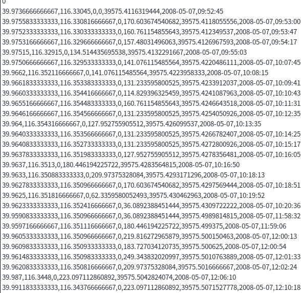

#### (左から)緯度、経度、意味ないデータ、意味ないデータ、高さ、日付、時間

>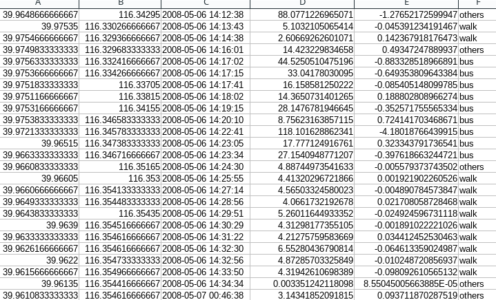

####  整形されたCSV、（左から）緯度、経度、日付と時間、速度、加速度、ラベル

> 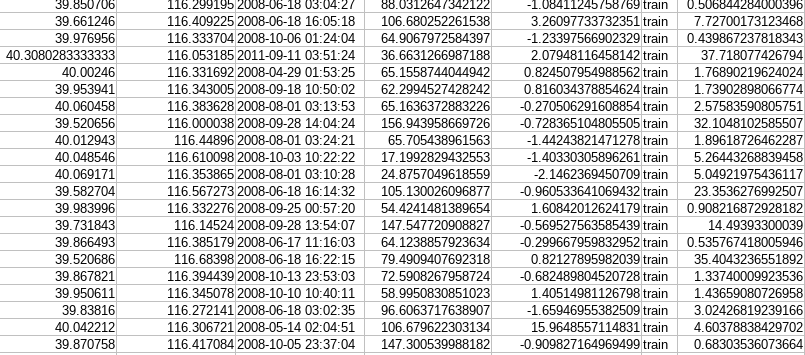

####  最寄り駅分布の追加、（左から）緯度、経度、日付と時間、速度、加速度、ラベル、最寄り駅からの距離

---

### 東京高速車データについて

> 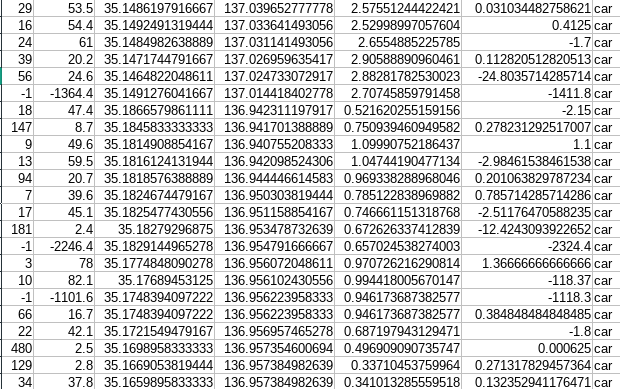

####  整形されたCSV、（左から）速度、加速度、緯度、経度、最寄り駅からの距離、ラベル

### 最後まとめた訓練データ

> 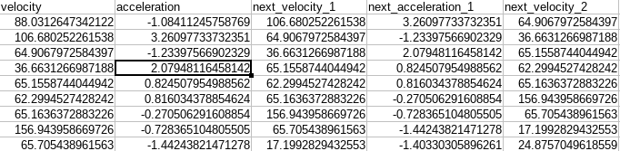

> 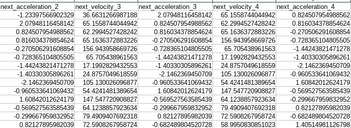

> 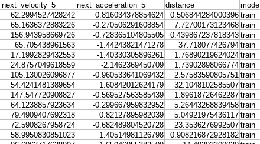

#### 隣接点の速度と加速度（カラム数が変えられる）、最寄り駅からの距離、検証用ラベル。ランダムフォレストに入れた形
 
---

> 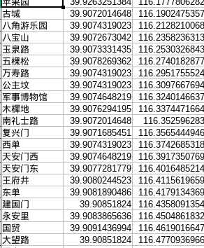

###  北京駅分布

> 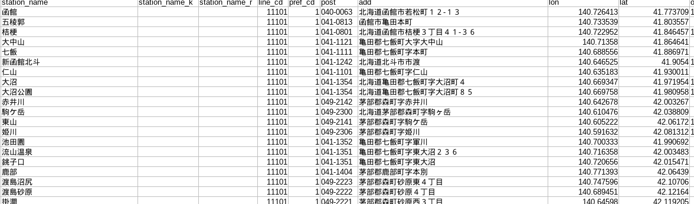

###  東京駅分布

## 学習データについて

### ブログウォッチャーからのユーザー位置情報

> 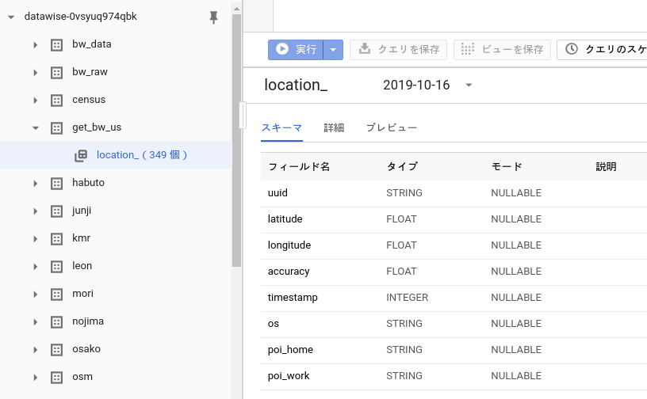

#### データの由来

> 

#### データの形

> 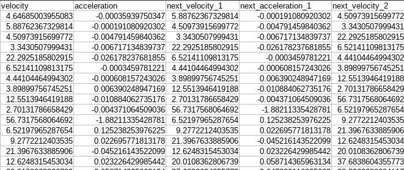

> 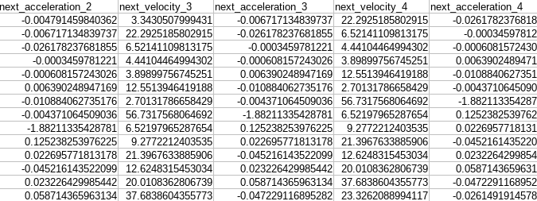

> 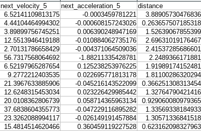

#### 訓練データとの同じ操作で変形した

### 結果の一つ

> 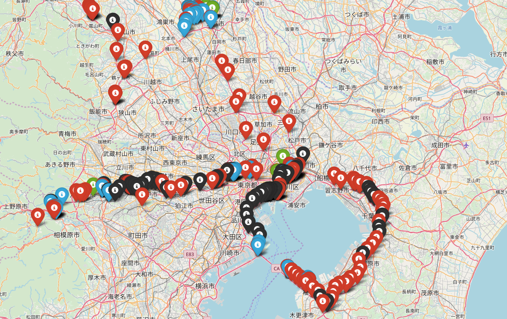

#### 赤（車）、黒（電車）、緑（バイク）、青（歩き）、
