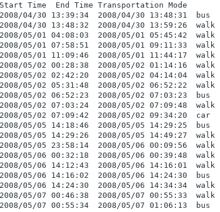
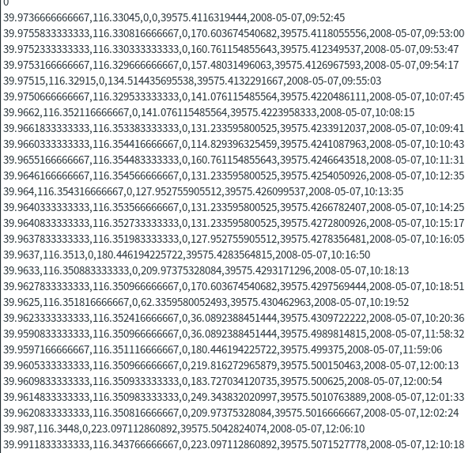
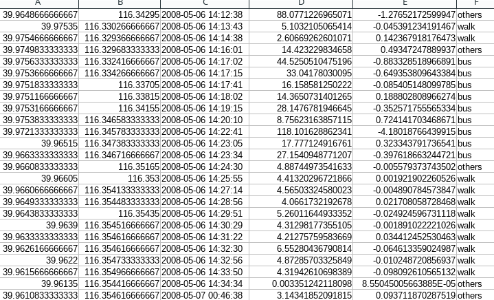
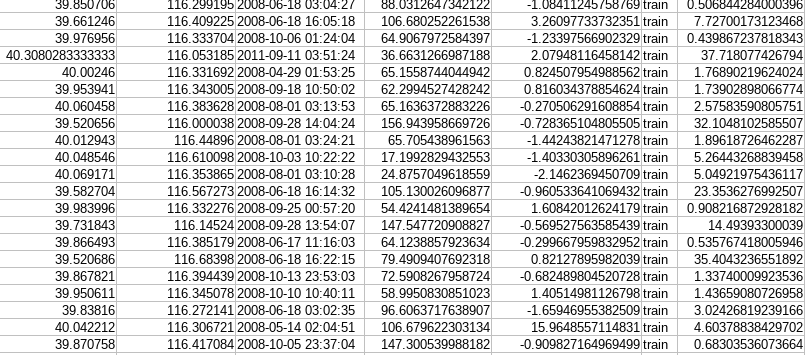
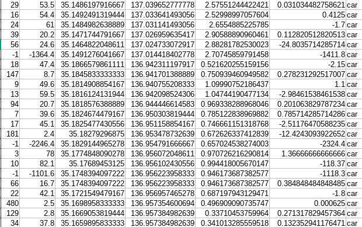
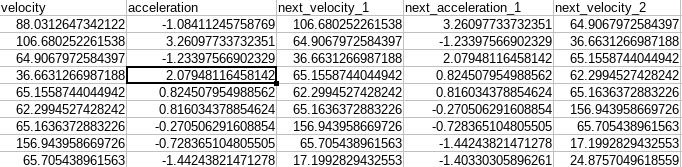
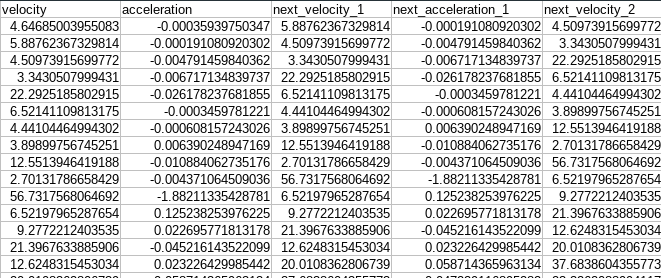
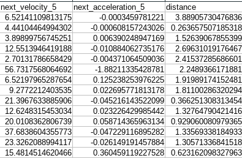
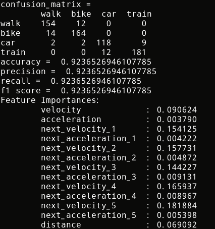
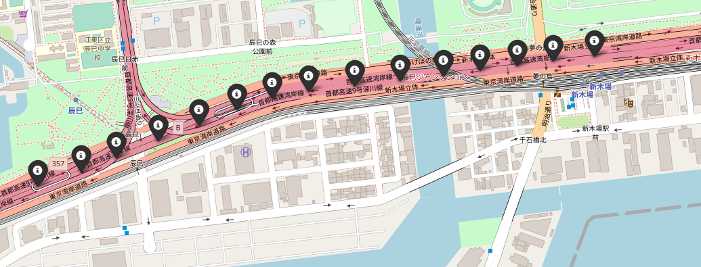

# 移動手段の判断
このプロジェクトの意図はブログウォッチャーからのユーザーデータを分析し、ケプラーでユーザーの移動手段を表示することである。教師データの由来は北京GEOLIFEのパブリックデータ（論文の出処:[こっち](http://www2009.eprints.org/80/1/p791.pdf)）と五十嵐さんからの車両データである。学習データは上記のブログウォッチャーからのユーザーデータである。ツールとしてはBigQuery、Pandas、sklearnのみである。

## 1 教師データ
### 1.1北京GEOLIFEデータについて
このデータセットは百人分ぐらいの年間のGPSデータを含んでいる。その中にのパラメータは緯度、経度、と時間帯しか使わなかった。

#### 1.1.1ラベルの時間帯(RAW)
このデータはユーサーの移動手段と時間帯しか表示しない。意味を与えるために、次のデータを扱わなければならない。

> 

#### 1.1.2（左から）緯度、経度、意味ないデータ、高さ、意味ないデータ、日付、時間(RAW)
下記のデータは一人分のユーサーGPSデータである。使われたパラメータとしては、緯度経度と時間帯である。

>

####  1.1.3 整形されたCSV、（左から）緯度、経度、日付と時間、速度、加速度、ラベル(PROCESSED)
1.1.1 と 1.1.2　をpandasで処理すると、1.1.3が結果として出る。ユーザーごとで速度、加速度を計算した上で、移動手段のラベルをつけた。

>

####  1.1.4 最寄り駅分布の追加、（左から）緯度、経度、日付と時間、速度、加速度、ラベル、最寄り駅からの距離(PROCESSED)
電車と車を良く分けるために、1.1.3　を基づき、あとで説明する駅分布データを利用し、最寄り駅からの距離を添加した。その上で、全ユーサーのデータをまとめた。

> 

---

### 1.2 東京高速車データについて

####  1.2.1 整形されたCSV、（左から）速度、加速度、緯度、経度、最寄り駅からの距離、ラベル　
電車と車を良く分けるために、東京の高速車のみデータを追加した。学習させられるように、1.1.4と同じ形にしなければならない。

> 

### 1.3 まとめた訓練データ

####	1.3.1 隣接点の速度と加速度（カラム数が変えられる）、最寄り駅からの距離、検証用ラベル。ランダムフォレストに入れた形

最後に学習させるデータとしては1.1.4と1.2.1の整合である。一つの点に対して、その次の４つの速度と加速度はパラメータとして学習させた。カラム数は隣接点の数に応じて変わる。隣接点の数の選択は2から5まで適当に決めた。只今、一つの点しか学習させない場合の結果が悪い、70%であり、電車と高速車の分けはほぼしていなかった。

> 

> 

> 

 
---
###  1.4 北京駅分布

1.1.4に言った通りの北京の駅分布データである。

> 

###  1.5 東京駅分布

1.1.5に使われた東京の駅分布データである。

> 

---

##　2 学習データについて

###　2.1 ブログウォッチャーからのユーザー位置情報

####　2.1.1 データの由来

毎日更新されているブログウォッチャーデータである。そのデータはBigQueryでdata-transferというプロジェクトに探せる。

> 

####　2.1.2 データの形
1.1.2　と似ているけれども、

> 

####　2.1.3 訓練データとの同じ操作で変形した
1.3.1 に合わせる様に、同様な処理を与えた。
> 

> 

> 

##　3 学習手法
五十嵐さんと討論した上で、ランダムフォレストが基礎的で有効な分類器として選ばれた。堀越さんがもっと適切な方法があれば、それを試さないわけではない。

まず、1.3.1のデータから、アウトライアーズ（至れないスピードとか）を抜き、４つの移動手段（walk,bike,train,car）を抽出した。バイアスが起こらない為に、同じくらいのサンプリングを取った。それに対して、ランダムフォレストのモデル(max_depth = 5, n_estimators = 100) に入れた。モデルは検証データについては92%ぐらいの正しさに至れる。

さらに、学習データの判断し難しいてん（速度が1km/h以下の点とか)と上記の様なアウトライアーズを抜き、データをランダムフォレストに入れて予測した。

###　3.1 結果の一つ

####　3.1.1 　モデルの結果

> 

####　3.1.2 一人分の移動手段の判別の可視化（赤（車）、黒（電車）、緑（バイク）、青（歩き））

> 

## 4 展望
主要問題としては電車と高速車の分けである。駅分布の添加した前に、電車と高速車の分けに速度と加速度は主要な参考である。それについて、結果が非常に理想的ではない。現有なモデルは正解データがなくても直感的に車と電車を区別している。只今のモデルの精度は高くないと言っても良い。3.1.2のユーサーは実際に車だけで移動しているけれども、幾つの点は電車を表している。

### 4.1 判別の間違い
直感的に考えると下記のユーサーは高速道路で移動しているから、車のはずですが、電車に表示されている。
> 
